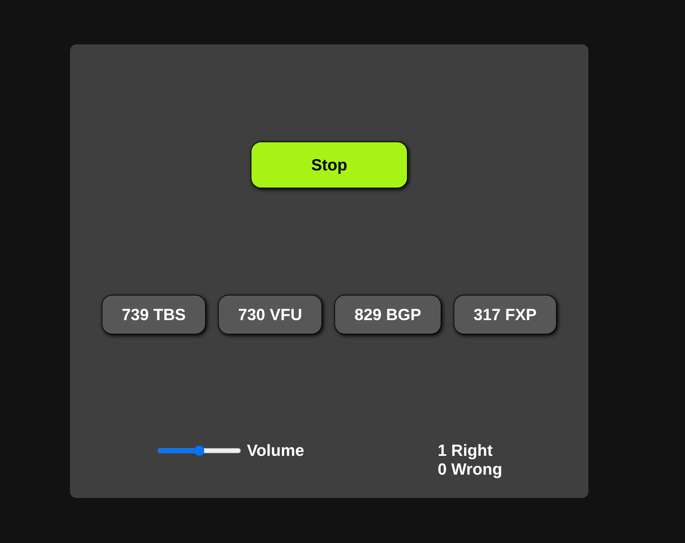

# Training Listening Memory and Multitasking
 

A small project made with vanilla Javascript, HTML, and CSS. There is a simple node express server to serve the files to localhost:3000. 

Run `npm start` in the main directory to start the server, then go to localhost:3000 in a browser to play. 

The gameplay loop involves a voice reading a few codes that consist of 3 numbers and 3 letters.  After which it presents four options and you have to select the code that you heard. 

There are three different difficulty options.

##### Fast Challenge 
- Meant as a test to see how hard the task is for you
- Speaks 3 codes to the user
- 3 second delay between each code read
##### Training
- Use this in the background while you do other tasks to practice multitasking
- Speaks 3 codes to the user
- Random delay of 7 to 30 seconds between each code read
##### Hard
- A more difficult challenge
- Speaks 5 codes to the user
- Random delay of 3 to 6 seconds between each code read
 

### Notes
- The "Debug" option prints the program's inner workings to the console
- I've found Chrome's voices to be significantly better then Firefox

  
### Future Ideas
 
Problem: 
It's too easy to skip memorising either the numbers or the letters 
Solution: 
Add in rounds where all the possible answers have the same 3 letters or numbers
  
Stretch Idea: 
It would be interesting to add a skill rating system that tracks your ability to answer questions. Then it could dynamically increase the difficulty by increasing the number of codes read or increasing the number of letters / numbers in each code. You could also use the idea from above where you add in different rounds to check if the user is gaming the system. Then you could increase the number of rounds that directly target their workaround.  
  
Stretch Idea: 
Would love to flesh out this idea by adding in a multitasking style of game on top of this vocal memory element. So that it becomes a multitasking training game. 
